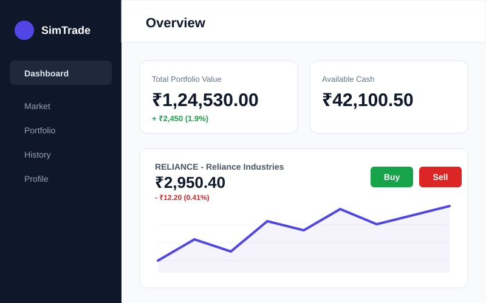
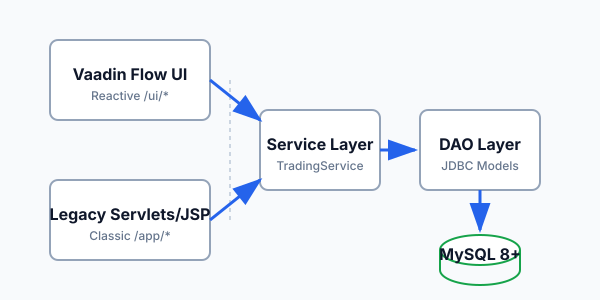

<p align="center">
  
</p>

<p align="center">
  <strong>A Java-Based Paper Trading Platform</strong>
</p>

<p align="center">
  
  
  
  
  
</p>

---

SimTrade is an educational paper-trading platform that simulates stock market operations in a risk-free environment. Users start with a virtual cash balance of $100,000, browse a live simulated market, execute buy and sell orders, and track portfolio performance over time. The platform is built as a Java WAR application with a dual-interface architecture: a modern **Vaadin Flow** reactive UI and a legacy **Servlet/JSP** interface, both backed by a shared service and data-access layer connected to MySQL.

<p align="center">
  
  <br />
  <em>Illustrative paper-trading dashboard with simulated data</em>
</p>

---

## Features

<table>
  <tr>
    <td align="center" width="33%">
      <br />
      <strong>Market Simulation</strong><br />
      <sub>Background thread dynamically adjusts stock prices with randomized volatility to simulate live market conditions.</sub>
    </td>
    <td align="center" width="33%">
      <br />
      <strong>Portfolio Management</strong><br />
      <sub>Real-time portfolio valuation with holdings breakdown, available cash, total equity, and unrealized P&amp;L tracking.</sub>
    </td>
    <td align="center" width="33%">
      <br />
      <strong>Trade Execution</strong><br />
      <sub>Synchronized order engine with buy/sell execution, insufficient-funds protection, and quantity validation.</sub>
    </td>
  </tr>
  <tr>
    <td align="center" width="33%">
      <br />
      <strong>Authentication &amp; Access</strong><br />
      <sub>Session-based login with password hashing, role-based access control (USER/ADMIN), and server-side route guards.</sub>
    </td>
    <td align="center" width="33%">
      <br />
      <strong>Dual Interface</strong><br />
      <sub>Modern Vaadin Flow UI at <code>/ui/*</code> and legacy Servlet/JSP interface at <code>/app/*</code>, sharing the same backend.</sub>
    </td>
    <td align="center" width="33%">
      <br />
      <strong>Trade History</strong><br />
      <sub>Complete transaction log with timestamps, quantities, prices, and realized profit/loss for every executed trade.</sub>
    </td>
  </tr>
</table>

---

## Architecture

<p align="center">
  
</p>

The application follows a layered architecture with clean separation of concerns:

| Layer | Responsibility | Key Classes |
|---|---|---|
| **Vaadin UI** | Reactive single-page interface. Routes prefixed with `/ui/` | `DashboardView`, `MarketView`, `PortfolioView`, `HistoryView` |
| **Servlet/JSP UI** | Traditional server-rendered pages. Routes prefixed with `/app/` | `DashboardServlet`, `MarketServlet`, `BuyServlet`, `SellServlet` |
| **Service** | Business logic, order execution, market simulation | `TradingService`, `PortfolioService`, `StockService`, `UserService` |
| **DAO** | JDBC-based data access with prepared statements | `UserDAO`, `StockDAO`, `TradeDAO`, `HoldingDAO`, `StatsDAO` |
| **Database** | MySQL 8.0+ with InnoDB, CHECK constraints, foreign keys | `schema.sql`, `seed.sql` |

The two UI layers are intentionally separated. The Vaadin interface provides a modern reactive experience, while the Servlet/JSP interface satisfies academic requirements for demonstrating traditional Java web technologies including JSTL, JSP fragments (`header.jspf`, `footer.jspf`), and servlet filters.

---

## Technology Stack

| Category | Technology | Version |
|---|---|---|
| Language | Java (JDK) | 17 |
| Modern UI | Vaadin Flow | 24.3.0 |
| Legacy UI | Jakarta Servlet API, JSP, JSTL | 6.0.0 / 3.0.x |
| Database | MySQL | 8.0+ |
| JDBC Driver | MySQL Connector/J | 8.4.0 |
| Build Tool | Apache Maven | 3.8+ |
| Application Server | Apache Tomcat | 10.1 |
| Testing | JUnit Jupiter | 5.10.2 |

---

## Getting Started

### Prerequisites

- **JDK 17** or later
- **MySQL 8.0+** running locally
- **Apache Maven 3.8+**
- **Apache Tomcat 10.1+**

### 1. Clone the Repository

```bash
git clone https://github.com/kunal-gswm/simtrade.git
cd simtrade
```

### 2. Create the Database

> **Warning:** The `schema.sql` script begins with `DROP DATABASE IF EXISTS papertrade`. Running it will destroy any existing `papertrade` database. Back up your data if necessary.

```bash
mysql -u root -p < db/schema.sql
mysql -u root -p papertrade < db/seed.sql
```

This creates the `papertrade` database with four tables (`users`, `stocks`, `holdings`, `trades`) and populates it with seed data including sample stocks and a default admin account.

### 3. Configure Database Credentials

Create the file `src/main/resources/db.properties` (this file is git-ignored to prevent credential leakage):

```properties
db.url=jdbc:mysql://localhost:3306/papertrade
db.user=root
db.password=YOUR_PASSWORD
```

For tests, create `src/test/resources/db.properties` pointing to an isolated test database:

```properties
db.url=jdbc:mysql://localhost:3306/papertrade_test
db.user=root
db.password=YOUR_PASSWORD
```

### 4. Build

```bash
mvn clean package -DskipTests
```

This compiles the Java sources, builds the Vaadin frontend bundle, and produces `target/paper-trading.war`.

### 5. Deploy

Copy the WAR file to your Tomcat `webapps` directory:

```bash
cp target/paper-trading.war $CATALINA_HOME/webapps/
```

Start Tomcat and open:

```
http://localhost:8080/paper-trading
```

---

## Testing

The project includes a JUnit 5 test suite covering service logic, DAO operations, and security constraints:

```bash
mvn clean test
```

| Test Class | Coverage |
|---|---|
| `TradingServiceTest` | Buy/sell execution, concurrent order handling, insufficient funds |
| `UserServiceTest` | Registration, authentication, profile updates, duplicate detection |
| `AdminFeaturesTest` | Admin service operations, user management, stock administration |
| `DashboardDataTest` | Dashboard statistics and aggregation queries |
| `PasswordUtilTest` | Password hashing and verification |
| `PnLCalculatorTest` | Profit and loss calculation accuracy |
| `AdminSecurityTest` | Admin route access control |
| `DashboardViewTest` | Vaadin view route configuration |

Tests run against the `papertrade_test` database configured in `src/test/resources/db.properties`, ensuring the development database is never modified during test execution.

---

## Security

- **Password storage:** User passwords are hashed before persistence; plaintext passwords are never stored.
- **Session management:** Authentication state is maintained via HTTP sessions with a 15-minute timeout configured in `web.xml`.
- **Route protection:** Server-side guards enforce authentication on protected views. Unauthenticated users are redirected to the login page.
- **Role-based access:** Admin routes and operations are restricted to users with the `ADMIN` role. The check is enforced server-side, not merely by hiding UI elements.
- **Credential isolation:** Database credentials (`db.properties`) are excluded from version control via `.gitignore`.

> **Note:** SimTrade is an educational paper-trading simulator. It does not connect to real financial markets, process real money, or provide investment advice. It is not suitable for production brokerage use.

---

## Project Structure

```
simtrade/
├── db/
│   ├── schema.sql                  # Database DDL
│   └── seed.sql                    # Sample data
├── docs/
│   └── assets/                     # SVG assets for documentation
├── src/
│   ├── main/
│   │   ├── java/com/project/trading/
│   │   │   ├── dao/                # JDBC data access objects
│   │   │   ├── exception/          # Custom exceptions
│   │   │   ├── filter/             # Servlet filters
│   │   │   ├── listener/           # Context listeners
│   │   │   ├── model/              # Domain models
│   │   │   ├── service/            # Business logic layer
│   │   │   ├── servlet/            # Legacy servlet controllers
│   │   │   ├── simulator/          # Market price simulator
│   │   │   ├── ui/                 # Vaadin Flow views and layouts
│   │   │   ├── util/               # Utilities (DBConnection, etc.)
│   │   │   └── web/                # Additional web controllers
│   │   ├── resources/
│   │   │   └── db.properties       # Database config (git-ignored)
│   │   └── webapp/
│   │       └── WEB-INF/
│   │           ├── jsp/            # JSP pages and fragments
│   │           └── web.xml         # Deployment descriptor
│   └── test/
│       └── java/com/project/trading/
│           ├── service/            # Service layer tests
│           └── ui/                 # UI and security tests
└── pom.xml                         # Maven build configuration
```

---

## License

No license file has been specified for this repository. All rights are reserved by the author unless otherwise stated.
